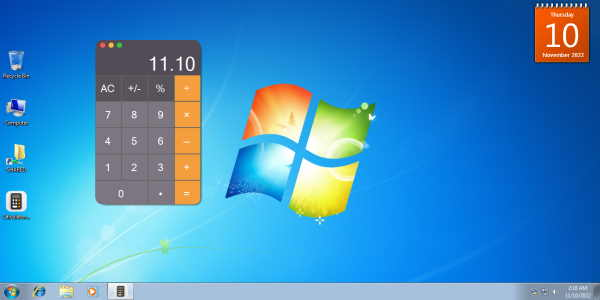
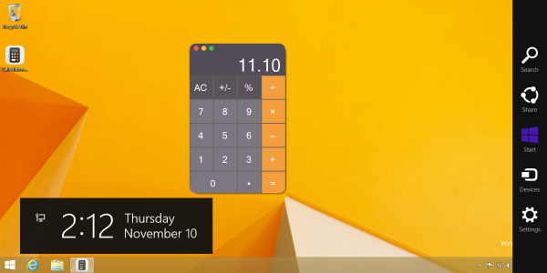
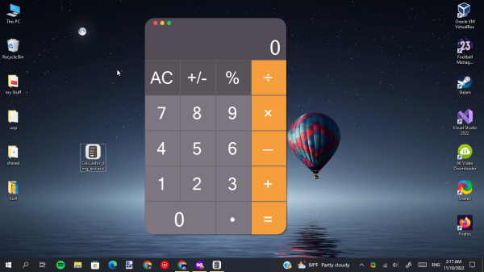

# DMG recipe with EXE taste
🧮 Have you ever thought about getting the exclusive MacOs calculator design in Windows?

## ❓ FAQ

#### How Can I Try It ?

Don't have more difficult questions?
just download the exe and run it !
started from windows (7),(8.1),(10),and also (11)

## 🛠 Skills
i used the native [.net 4.8] component, and created my own UserControl With No Additionals Outside Tools.

## 🥇 Author (me)
- [@YousefHurf](https://fb.com/yousef.my10)

## 📸 Screenshots

windows 7 🖥

windows 8.1 🖥

windows 10 🖥

windows 11 🖥

